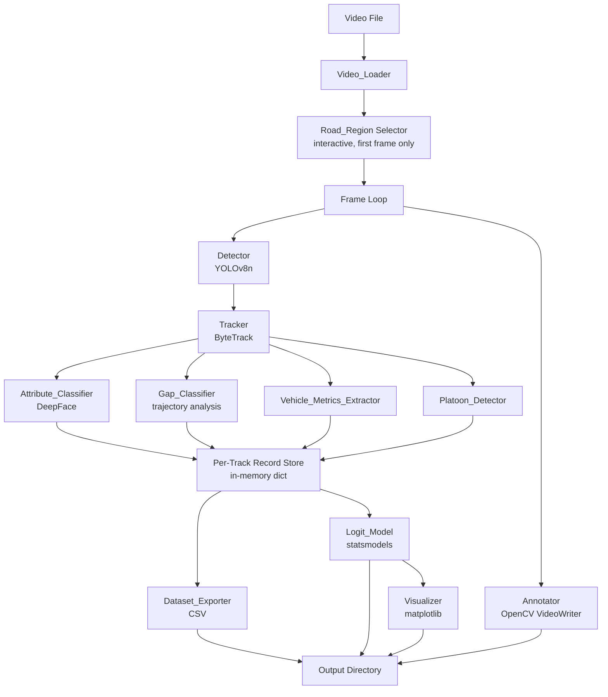

# Design Document: Pedestrian Gap Acceptance Analysis

## Overview

The system is a single-pass video analysis pipeline that processes a 2-hour field recording of a pedestrian crossing. It runs object detection and tracking on every frame, classifies pedestrian attributes and crossing behavior, extracts vehicle traffic metrics, and produces a structured dataset for statistical modeling. The final outputs are an annotated video, a CSV dataset, a logistic regression summary, and six visualization plots — all suitable for academic submission.

The pipeline is implemented in Python and executed as a single script (or small set of modules). Processing is sequential and frame-by-frame; no distributed or real-time infrastructure is required. The user interacts once at startup to define the Road_Region polygon; all subsequent processing is fully automated.

### Key Design Decisions

- **YOLOv8n + ByteTrack** are used for detection and tracking because they are lightweight, well-supported via the `ultralytics` package, and ByteTrack is the default tracker bundled with it.
- **DeepFace** is used for attribute classification because it provides age and gender estimation from a single crop without requiring a custom-trained model.
- **statsmodels** is used for logistic regression because it produces the full coefficient table, p-values, confidence intervals, and odds ratios needed for academic reporting.
- **Gap classification is trajectory-based** (speed drop threshold) rather than heuristic, making it reproducible and parameterizable.
- **All thresholds are centralized** in a single `config.py` so they can be adjusted without touching pipeline logic.

---

## Architecture

The pipeline follows a linear stage architecture. Each stage consumes outputs from the previous stage and produces structured data for the next. There is no back-channel communication between stages.



### Processing Flow

1. **Startup**: Load video, display first frame, user clicks polygon vertices for Road_Region.
2. **Frame loop**: For each frame, run detection → tracking → spatial filtering → attribute classification (first entry only) → vehicle metrics update → platoon check → annotation.
3. **Track completion**: When a pedestrian track exits the Road_Region, run gap classification on its stored trajectory.
4. **Post-processing**: After all frames, export CSV, fit logistic regression, generate plots.

---

## Components and Interfaces

### `config.py`

Centralizes all tunable parameters. No logic — pure constants.

```python
VIDEO_PATH: str                  # input video file path
OUTPUT_DIR: str                  # output directory path
YOLO_MODEL: str = "yolov8n.pt"
YOLO_CONF_THRESHOLD: float = 0.3
YOLO_CLASSES: list[int]          # COCO IDs: person=0, car=2, bus=5, truck=7, motorcycle=3
BYTETRACK_MAX_AGE: int = 30      # frames before track is marked lost
ROLLING_GAP_SPEED_RATIO: float = 0.20   # 20% of mean speed
ROLLING_GAP_MIN_DURATION: float = 0.5  # seconds
AGE_YOUNG_MAX: int = 29
AGE_MIDDLE_MAX: int = 59
MIN_RECORDS_FOR_REGRESSION: int = 30
PLOT_DPI: int = 150
OUTPUT_VIDEO_CODEC: str = "mp4v"
```

---

### `video_loader.py` — `VideoLoader`

**Responsibility**: Open the video file and expose frame iteration and metadata.

```python
class VideoLoader:
    def __init__(self, path: str) -> None: ...
    def open(self) -> None:
        """Opens the video. Raises FileNotFoundError or IOError on failure."""
    @property
    def fps(self) -> float: ...
    @property
    def frame_count(self) -> int: ...
    @property
    def width(self) -> int: ...
    @property
    def height(self) -> int: ...
    def read_frame(self) -> tuple[bool, np.ndarray | None]: ...
    def release(self) -> None: ...
```

Raises `SystemExit` with a descriptive message if the file cannot be opened (Requirement 1.2).

---

### `road_region.py` — `RoadRegionSelector`

**Responsibility**: Display the first frame and collect polygon vertices via mouse clicks.

```python
class RoadRegionSelector:
    def select(self, frame: np.ndarray) -> np.ndarray:
        """Returns Nx2 array of polygon vertices. Loops until >= 3 vertices collected."""
    def point_in_region(self, point: tuple[float, float], polygon: np.ndarray) -> bool:
        """Uses cv2.pointPolygonTest for containment check."""
```

Uses OpenCV `setMouseCallback`. Pressing Enter/Space confirms the polygon; pressing R resets. Enforces minimum 3 vertices (Requirement 4.4).

---

### `detector.py` — `Detector`

**Responsibility**: Run YOLOv8n inference on a frame and return filtered detections.

```python
@dataclass
class Detection:
    bbox: tuple[float, float, float, float]  # x1, y1, x2, y2
    confidence: float
    class_id: int
    class_name: str

class Detector:
    def __init__(self, model_path: str, conf_threshold: float, target_classes: list[int]) -> None: ...
    def detect(self, frame: np.ndarray) -> list[Detection]: ...
```

Returns empty list when no target-class objects are detected (Requirement 2.3). Uses pretrained COCO weights (Requirement 2.2).

---

### `tracker.py` — `PedestrianTracker`

**Responsibility**: Wrap ByteTrack (via `ultralytics`) to maintain consistent pedestrian IDs.

```python
@dataclass
class Track:
    track_id: int
    bbox: tuple[float, float, float, float]
    confidence: float
    centroid: tuple[float, float]

class PedestrianTracker:
    def __init__(self, max_age: int) -> None: ...
    def update(self, detections: list[Detection], frame: np.ndarray) -> list[Track]: ...
```

Only pedestrian detections (class_id == 0) are passed to the tracker. Returns active tracks per frame (Requirements 3.1–3.4).

---

### `attribute_classifier.py` — `AttributeClassifier`

**Responsibility**: Classify gender and age group for a pedestrian crop using DeepFace.

```python
@dataclass
class PedestrianAttributes:
    gender: str   # "Male" | "Female" | "Unknown"
    age_group: str  # "Young" | "Middle" | "Old" | "Unknown"

class AttributeClassifier:
    def classify(self, crop: np.ndarray) -> PedestrianAttributes: ...
    @staticmethod
    def age_to_group(age: int) -> str: ...
```

Called once per track on first entry into Road_Region. Catches all DeepFace exceptions and returns `"Unknown"` (Requirement 5.4). Age bucketing: Young < 30, Middle 30–59, Old ≥ 60 (Requirement 5.3).

---

### `gap_classifier.py` — `GapClassifier`

**Responsibility**: Classify a completed crossing trajectory as Straight or Rolling Gap.

```python
class GapClassifier:
    def __init__(self, fps: float, speed_ratio: float, min_duration: float) -> None: ...
    def classify(self, trajectory: list[tuple[float, float]]) -> str:
        """
        trajectory: list of (cx, cy) centroids in frame order, within Road_Region.
        Returns "Straight" or "Rolling".
        """
    def compute_speeds(self, trajectory: list[tuple[float, float]]) -> list[float]:
        """Returns per-frame pixel displacement values."""
```

Algorithm:
1. Compute per-frame displacement between consecutive centroids → speed sequence.
2. Compute mean speed over the full trajectory.
3. Find contiguous runs where speed < `speed_ratio * mean_speed`.
4. If any run lasts ≥ `min_duration * fps` frames → Rolling Gap; else → Straight Gap.

(Requirements 6.2–6.4)

---

### `vehicle_metrics.py` — `VehicleMetricsExtractor`

**Responsibility**: Track vehicle entry/exit events in the Road_Region and compute gap metrics.

```python
@dataclass
class VehicleEvent:
    frame_idx: int
    timestamp: float  # seconds = frame_idx / fps
    event_type: str   # "entry" | "exit"
    vehicle_id: int

@dataclass
class GapMetrics:
    gap_seconds: float
    time_headway: float
    vehicle_speed_px_per_s: float

class VehicleMetricsExtractor:
    def __init__(self, fps: float) -> None: ...
    def update(self, frame_idx: int, vehicle_tracks: list[Track], in_region: set[int]) -> None:
        """Called each frame with vehicle tracks whose centroids are in Road_Region."""
    def get_gap_at_frame(self, frame_idx: int) -> GapMetrics: ...
    def compute_time_headway(self) -> float: ...
```

Gap duration = time between last vehicle exit and next vehicle entry (Requirement 7.2). Time headway = mean interval between consecutive entry timestamps (Requirement 7.3). Speed = centroid displacement / frame interval in seconds (Requirement 7.4).

---

### `platoon_detector.py` — `PlatoonDetector`

**Responsibility**: Determine per-frame co-presence of pedestrian tracks in Road_Region.

```python
class PlatoonDetector:
    def update(self, frame_idx: int, track_ids_in_region: set[int]) -> None:
        """Records which track IDs are co-present in each frame."""
    def get_platoon_flag(self, track_id: int) -> str:
        """Returns "Group" if track was ever co-present with another, else "Alone"."""
```

A track is flagged "Group" if, in any frame during its Road_Region presence, at least one other track was also present (Requirements 8.1–8.3).

---

### `record_store.py` — `RecordStore`

**Responsibility**: In-memory accumulation of all per-track data during the frame loop.

```python
@dataclass
class PedestrianRecord:
    track_id: int
    gender: str
    age_group: str
    platoon: str
    gap_seconds: float
    time_headway: float
    vehicle_speed: float
    gap_type: str        # "Straight" | "Rolling"
    gap_type_binary: int # 1 = Straight, 0 = Rolling
    trajectory: list[tuple[float, float]]  # not exported to CSV
    entry_frame: int
    exit_frame: int
    complete: bool       # True only when track exits Road_Region cleanly

class RecordStore:
    def get_complete_records(self) -> list[PedestrianRecord]: ...
```

Only records with `complete=True` are exported (Requirement 9.5).

---

### `dataset_exporter.py` — `DatasetExporter`

**Responsibility**: Write complete records to CSV.

```python
class DatasetExporter:
    def export(self, records: list[PedestrianRecord], output_dir: str) -> str:
        """Returns path to written CSV file."""
```

Output filename: `gap_acceptance_dataset.csv`. Columns: `track_id`, `gender`, `age_group`, `platoon`, `gap_seconds`, `time_headway`, `vehicle_speed`, `gap_type` (Requirements 9.1–9.4).

---

### `logit_model.py` — `LogitModel`

**Responsibility**: Fit Binary Logistic Regression and save summary.

```python
class LogitModel:
    def fit(self, csv_path: str) -> sm.discrete.discrete_model.LogitResults: ...
    def save_summary(self, results, output_dir: str) -> None: ...
    def get_odds_ratios(self, results) -> pd.DataFrame: ...
```

Uses `statsmodels.formula.api.logit`. Categorical encoding via `pd.get_dummies` with drop_first=True. Warns if record count < 30 (Requirement 10.6). Saves `logit_model_summary.txt` (Requirement 10.5).

---

### `visualizer.py` — `Visualizer`

**Responsibility**: Generate and save the 6 required plots.

```python
class Visualizer:
    def __init__(self, output_dir: str, dpi: int = 150) -> None: ...
    def plot_gap_type_distribution(self, df: pd.DataFrame) -> None: ...
    def plot_gender_vs_gap_type(self, df: pd.DataFrame) -> None: ...
    def plot_age_group_vs_gap_type(self, df: pd.DataFrame) -> None: ...
    def plot_platoon_vs_gap_type(self, df: pd.DataFrame) -> None: ...
    def plot_gap_duration_boxplot(self, df: pd.DataFrame) -> None: ...
    def plot_odds_ratios(self, odds_df: pd.DataFrame) -> None: ...
    def generate_all(self, df: pd.DataFrame, odds_df: pd.DataFrame) -> None: ...
```

All plots include axis labels, title, and legend (Requirement 11.2). Saved at ≥ 150 DPI (Requirement 11.3).

---

### `annotator.py` — `Annotator`

**Responsibility**: Draw overlays on frames and write annotated video.

```python
class Annotator:
    def __init__(self, output_dir: str, fps: float, width: int, height: int, codec: str) -> None: ...
    def annotate_frame(
        self,
        frame: np.ndarray,
        tracks: list[Track],
        polygon: np.ndarray,
        record_store: RecordStore,
    ) -> np.ndarray: ...
    def write_frame(self, frame: np.ndarray) -> None: ...
    def release(self) -> None: ...
```

Draws: bounding boxes + track IDs, Road_Region polygon, gender/age/gap_type labels (once known). Output: `annotated_output.mp4` (Requirements 12.1–12.4). Catches VideoWriter failures and logs without terminating (Requirement 12.5).

---

### `main.py` — Pipeline Orchestrator

Ties all components together. Runs the frame loop, calls each component in order, and triggers post-processing after the loop.

```
main.py
├── parse args / load config
├── VideoLoader.open()
├── RoadRegionSelector.select(first_frame)
├── initialize Detector, PedestrianTracker, AttributeClassifier,
│   GapClassifier, VehicleMetricsExtractor, PlatoonDetector,
│   RecordStore, Annotator
├── for each frame:
│   ├── Detector.detect(frame)
│   ├── PedestrianTracker.update(ped_detections, frame)
│   ├── spatial filter → tracks_in_region, vehicles_in_region
│   ├── AttributeClassifier.classify() for new track entries
│   ├── RecordStore.update_trajectory(track, frame_idx)
│   ├── VehicleMetricsExtractor.update(frame_idx, vehicle_tracks, in_region)
│   ├── PlatoonDetector.update(frame_idx, ped_ids_in_region)
│   ├── for tracks that just exited: GapClassifier.classify(trajectory)
│   └── Annotator.annotate_frame() + write_frame()
├── DatasetExporter.export(complete_records)
├── LogitModel.fit(csv_path)
├── Visualizer.generate_all(df, odds_df)
└── Annotator.release()
```

---

## Data Models

### CSV Schema — `gap_acceptance_dataset.csv`

| Column | Type | Values | Notes |
|---|---|---|---|
| `track_id` | int | ≥ 1 | ByteTrack assigned ID |
| `gender` | str | Male, Female, Unknown | DeepFace output |
| `age_group` | str | Young, Middle, Old, Unknown | Bucketed from DeepFace age |
| `platoon` | str | Group, Alone | Co-presence flag |
| `gap_seconds` | float | ≥ 0.0 | Time between vehicle exit and next entry |
| `time_headway` | float | ≥ 0.0 | Mean inter-vehicle entry interval (seconds) |
| `vehicle_speed` | float | ≥ 0.0 | Pixels per second |
| `gap_type` | int | 0, 1 | 1 = Straight, 0 = Rolling |

### In-Memory Trajectory Format

Each active pedestrian track accumulates a list of `(cx, cy)` float tuples — one per frame while the centroid is inside the Road_Region. This list is passed to `GapClassifier.classify()` when the track exits.

### Vehicle Event Log

A list of `VehicleEvent` objects maintained by `VehicleMetricsExtractor`. Used to compute gap durations and time headway after all frames are processed.

### File Outputs

```
<output_dir>/
├── gap_acceptance_dataset.csv
├── logit_model_summary.txt
├── annotated_output.mp4
├── plot_gap_type_distribution.png
├── plot_gender_vs_gap_type.png
├── plot_age_group_vs_gap_type.png
├── plot_platoon_vs_gap_type.png
├── plot_gap_duration_boxplot.png
└── plot_odds_ratios.png
```

---

## Module / File Structure

```
pedestrian_gap_analysis/
├── main.py                    # pipeline orchestrator
├── config.py                  # all tunable constants
├── video_loader.py            # VideoLoader
├── road_region.py             # RoadRegionSelector
├── detector.py                # Detector, Detection dataclass
├── tracker.py                 # PedestrianTracker, Track dataclass
├── attribute_classifier.py    # AttributeClassifier, PedestrianAttributes
├── gap_classifier.py          # GapClassifier
├── vehicle_metrics.py         # VehicleMetricsExtractor, VehicleEvent, GapMetrics
├── platoon_detector.py        # PlatoonDetector
├── record_store.py            # RecordStore, PedestrianRecord
├── dataset_exporter.py        # DatasetExporter
├── logit_model.py             # LogitModel
├── visualizer.py              # Visualizer
├── annotator.py               # Annotator
└── tests/
    ├── test_gap_classifier.py
    ├── test_vehicle_metrics.py
    ├── test_attribute_classifier.py
    ├── test_platoon_detector.py
    ├── test_dataset_exporter.py
    ├── test_logit_model.py
    └── test_visualizer.py
```

---

## Key Algorithms

### Gap Type Classification (GapClassifier)

```
Input: trajectory = [(cx0,cy0), (cx1,cy1), ..., (cxN,cyN)]
       fps, speed_ratio=0.20, min_duration=0.5s

1. speeds = [dist(p[i], p[i+1]) for i in range(len-1)]
   (pixel displacement per frame = pixels/frame)
2. mean_speed = mean(speeds)
3. If mean_speed == 0: return "Straight"  (stationary edge case)
4. threshold = speed_ratio * mean_speed
5. slow_frames = [s < threshold for s in speeds]
6. Find maximal contiguous runs of True in slow_frames
7. min_frames = ceil(min_duration * fps)
8. If any run length >= min_frames: return "Rolling"
9. Else: return "Straight"
```

### Vehicle Gap Duration Computation

```
Input: sorted list of VehicleEvent (entry/exit per vehicle)

1. Build timeline of Road_Region occupancy:
   - occupied[t] = True if any vehicle is in region at time t
2. Gap periods = contiguous intervals where occupied == False
3. gap_seconds for a pedestrian crossing at frame F =
   duration of the gap period that contains frame F
   (or 0.0 if pedestrian crossed during vehicle presence)
```

### Time Headway Computation

```
entry_times = [e.timestamp for e in events if e.event_type == "entry"]
If len(entry_times) < 2: time_headway = 0.0
Else: time_headway = mean([entry_times[i+1] - entry_times[i]
                           for i in range(len-1)])
```

### Platoon Detection

```
For each frame F:
  ids_in_region = {track_id for track in active_tracks
                   if centroid_in_polygon(track.centroid, polygon)}
  if len(ids_in_region) >= 2:
    for each id in ids_in_region: platoon_flag[id] = "Group"
  else:
    for each id in ids_in_region:
      if id not already flagged "Group": platoon_flag[id] = "Alone"
```

### Age Group Bucketing

```
age_to_group(age):
  if age <= 29: return "Young"
  if age <= 59: return "Middle"
  return "Old"
```

---

## Error Handling

| Scenario | Component | Behavior |
|---|---|---|
| Video file not found / unreadable | VideoLoader | Print descriptive error, `sys.exit(1)` |
| Polygon < 3 vertices | RoadRegionSelector | Re-prompt user, do not proceed |
| DeepFace fails on crop | AttributeClassifier | Assign "Unknown", log warning, continue |
| Track lost mid-crossing | RecordStore | Mark `complete=False`, exclude from CSV |
| Dataset < 30 records | LogitModel | Print warning, fit model anyway |
| VideoWriter codec unavailable | Annotator | Log error, skip video writing, continue |
| No vehicles detected in window | VehicleMetricsExtractor | Record gap_seconds = window duration |
| Empty trajectory (0 or 1 points) | GapClassifier | Return "Straight" (no speed drop possible) |

---

## Testing Strategy

### Unit Tests (example-based)

Each module has a corresponding test file. Tests use `pytest` and cover:
- Correct outputs for representative inputs
- Edge cases (empty lists, zero speeds, single-point trajectories, unknown attributes)
- Error handling paths (file not found, DeepFace exception, codec failure)

### Property-Based Tests

Property-based tests use **Hypothesis** (Python) with a minimum of **100 iterations** per property. Each test is tagged with a comment referencing the design property it validates.

Tag format: `# Feature: pedestrian-gap-acceptance-analysis, Property {N}: {property_text}`

Property tests are located in the same `tests/` directory, prefixed with `test_properties_`.

### Integration Tests

- End-to-end smoke test with a short synthetic video (10–20 frames, generated with OpenCV) verifying that the full pipeline runs without error and produces all expected output files.
- CSV schema validation: assert all required columns are present and types are correct.

### Test Dependencies

```
pytest
hypothesis
numpy
pandas
opencv-python
```


---

## Correctness Properties

*A property is a characteristic or behavior that should hold true across all valid executions of a system — essentially, a formal statement about what the system should do. Properties serve as the bridge between human-readable specifications and machine-verifiable correctness guarantees.*

### Property 1: VideoLoader metadata accuracy

*For any* synthetic video file with known fps, frame count, width, and height, after `VideoLoader.open()`, the properties `fps`, `frame_count`, `width`, and `height` shall exactly match the video's actual metadata.

**Validates: Requirements 1.3**

---

### Property 2: Track ID uniqueness and persistence

*For any* sequence of pedestrian detection frames where the same bounding box persists across consecutive frames (matched by IoU ≥ 0.5), the `PedestrianTracker` shall assign the same integer `track_id` to that detection in every frame it appears, and no two simultaneously active tracks shall share the same `track_id`.

**Validates: Requirements 3.1**

---

### Property 3: Track output structure completeness

*For any* non-empty list of pedestrian detections passed to `PedestrianTracker.update()`, every `Track` object in the returned list shall have a non-negative integer `track_id`, a 4-element float `bbox`, a float `confidence` in [0, 1], and a 2-element float `centroid`.

**Validates: Requirements 3.3**

---

### Property 4: Spatial filtering correctness

*For any* polygon with ≥ 3 vertices and any set of 2D points, `RoadRegionSelector.point_in_region()` shall return `True` for every point strictly inside the polygon and `False` for every point strictly outside, consistent with `cv2.pointPolygonTest`.

**Validates: Requirements 4.3**

---

### Property 5: Gender output domain

*For any* image crop passed to `AttributeClassifier.classify()`, the returned `gender` field shall always be one of `{"Male", "Female", "Unknown"}` — never any other value, even when DeepFace raises an exception.

**Validates: Requirements 5.2**

---

### Property 6: Age group bucketing correctness

*For any* integer age value `a` in the range [0, 150], `AttributeClassifier.age_to_group(a)` shall return `"Young"` if `a ≤ 29`, `"Middle"` if `30 ≤ a ≤ 59`, and `"Old"` if `a ≥ 60`. The output shall always be one of `{"Young", "Middle", "Old"}`.

**Validates: Requirements 5.3**

---

### Property 7: RecordStore attribute round-trip

*For any* `track_id` and any combination of `gender`, `age_group`, `platoon`, and `gap_type` values stored in `RecordStore`, retrieving the record for that `track_id` shall return exactly the same values that were stored — no mutation, no loss.

**Validates: Requirements 5.5, 6.5, 8.3**

---

### Property 8: Speed sequence computation

*For any* trajectory of N centroid positions `[(cx0,cy0), ..., (cxN-1,cyN-1)]` with N ≥ 2, `GapClassifier.compute_speeds()` shall return a list of exactly N−1 non-negative floats where each value equals the Euclidean distance between consecutive centroid pairs.

**Validates: Requirements 6.2**

---

### Property 9: Gap classification correctness

*For any* trajectory passed to `GapClassifier.classify()`:
- If the speed sequence contains a contiguous run of frames where speed < 20% of mean speed lasting ≥ `ceil(0.5 × fps)` frames, the result shall be `"Rolling"`.
- If no such run exists, the result shall be `"Straight"`.
- The result shall always be one of `{"Straight", "Rolling"}`.

**Validates: Requirements 6.3, 6.4**

---

### Property 10: Vehicle event recording correctness

*For any* sequence of per-frame vehicle presence updates, `VehicleMetricsExtractor` shall record an `"entry"` event exactly when a vehicle ID first appears in the Road_Region and an `"exit"` event exactly when it last appears — with no duplicate events for the same vehicle in the same entry/exit cycle.

**Validates: Requirements 7.1**

---

### Property 11: Gap duration computation

*For any* ordered list of vehicle entry/exit timestamps, the gap duration computed by `VehicleMetricsExtractor` for a given time window shall equal the time elapsed between the most recent vehicle exit before the window and the next vehicle entry after the window start, in seconds.

**Validates: Requirements 7.2**

---

### Property 12: Time headway computation

*For any* list of N vehicle entry timestamps `[t0, t1, ..., tN-1]` with N ≥ 2, `VehicleMetricsExtractor.compute_time_headway()` shall return the arithmetic mean of `[t1−t0, t2−t1, ..., tN-1−tN-2]`. For N < 2, it shall return 0.0.

**Validates: Requirements 7.3**

---

### Property 13: Vehicle speed computation

*For any* two consecutive centroid positions `(cx1, cy1)` and `(cx2, cy2)` and a known `fps`, the estimated vehicle speed shall equal `sqrt((cx2−cx1)² + (cy2−cy1)²) × fps` pixels per second.

**Validates: Requirements 7.4**

---

### Property 14: Platoon detection correctness

*For any* sequence of frames processed by `PlatoonDetector`:
- If a `track_id` was present in any frame where at least one other `track_id` was also in the Road_Region, `get_platoon_flag(track_id)` shall return `"Group"`.
- If a `track_id` was never co-present with any other track, `get_platoon_flag(track_id)` shall return `"Alone"`.
- The return value shall always be one of `{"Group", "Alone"}`.

**Validates: Requirements 8.1, 8.2**

---

### Property 15: CSV export completeness and filtering

*For any* list of `PedestrianRecord` objects with mixed `complete` flags, `DatasetExporter.export()` shall produce a CSV with exactly as many data rows as there are records with `complete=True`, and no row corresponding to any record with `complete=False`.

**Validates: Requirements 9.1, 9.5**

---

### Property 16: CSV schema and binary encoding correctness

*For any* list of complete `PedestrianRecord` objects exported by `DatasetExporter`, the resulting CSV shall contain exactly the columns `["track_id", "gender", "age_group", "platoon", "gap_seconds", "time_headway", "vehicle_speed", "gap_type"]`, and for every row, the `gap_type` column shall be `1` if the record's `gap_type` is `"Straight"` and `0` if it is `"Rolling"`.

**Validates: Requirements 9.2, 9.3**

---

### Property 17: Odds ratio computation

*For any* fitted `LogitModel`, the odds ratio for each predictor shall equal `exp(coefficient)` for that predictor, where `coefficient` is the value reported in the statsmodels summary. The odds ratio shall always be a positive float.

**Validates: Requirements 10.4**

---

### Property 18: Plot metadata completeness

*For any* valid `pd.DataFrame` passed to any `Visualizer` plot method, the resulting matplotlib `Figure` shall have a non-empty title, non-empty x-axis label, non-empty y-axis label, and at least one legend entry on the primary axes.

**Validates: Requirements 11.2**
